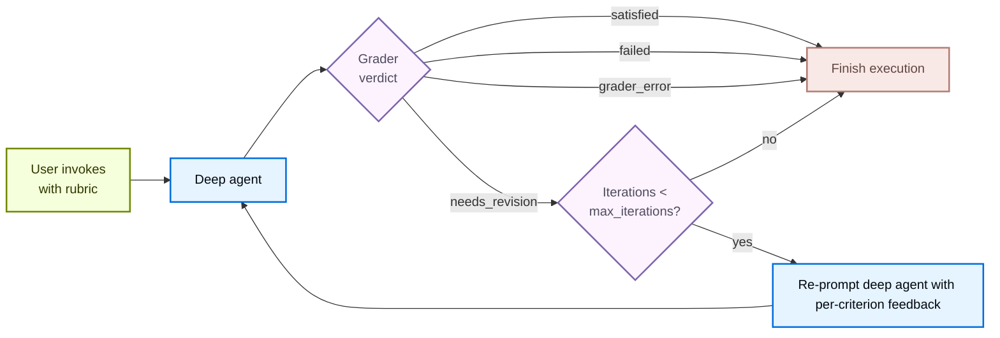

import RubricConfigurePy from '/snippets/code-samples/rubric-configure-py.mdx';
import RubricInvokePy from '/snippets/code-samples/rubric-invoke-py.mdx';
import RubricOnEvaluationPy from '/snippets/code-samples/rubric-on-evaluation-py.mdx';
import RubricStreamPy from '/snippets/code-samples/rubric-stream-py.mdx';

<Note>
`RubricMiddleware` requires `deepagents>=0.6.5`. It is in [**beta**](/oss/versioning); the API may change in the future.
</Note>

Some agent tasks have a clear definition of "done" that the model alone cannot reliably hit on the first try: a haiku in the right syllable pattern, a refactor with all tests passing, a report that hits every required section. `RubricMiddleware` lets you declare *what done looks like* as a rubric and have the agent **self-evaluate and iterate** until the rubric is satisfied (or a configured maximum iteration cap is hit).

When the deep agent finishes reasoning and has an output, a separate **grader sub-agent** reviews the transcript against the rubric. If the grader returns `needs_revision`, its feedback is injected back into the conversation and the agent runs again. The loop terminates on `satisfied`, `max_iterations_reached`, `failed`, or `grader_error`.



## Configure the middleware

Add `RubricMiddleware` to the `middleware` list when you call `create_deep_agent`:

<RubricConfigurePy />

| Argument | Required | Default | Description |
| --- | --- | --- | --- |
| `model` | Yes | `None` | Chat model used by the grader sub-agent. Accepts a `"provider:model-id"` string or a `BaseChatModel` instance. |
| `system_prompt` | No | Built-in grader prompt | Custom grading instructions. Falls back to a default system prompt that teaches the grader the verdict format and what tools it has at its disposal. |
| `tools` | No | `None` | Tools the grader may call to gather evidence (run tests, count tokens, read files) before producing a verdict. With none, the grader reasons from the transcript alone. |
| `max_iterations` | No | `3` | Hard cap on grader iterations per rubric attempt. Maximum input value is 20. When the cap is reached without a `satisfied` verdict, the agent terminates with status `max_iterations_reached`. |
| `on_evaluation` | No | `None` | Optional callback invoked with each `RubricEvaluation` after grading to be used with `invoke()`. Useful for evals, observability, or persisting iteration history. |

## Pass rubric on invocation

Pass a `rubric` string on invocation state to start the self-evaluation loop. Use `invoke()` for a single blocking call, or `stream(..., stream_mode="custom")` to receive grading events as they occur:

<Tabs>
    <Tab title="invoke()">
        <RubricInvokePy />
    </Tab>
    <Tab title="stream()">
        <RubricStreamPy />
    </Tab>
</Tabs>

### Rubric verdicts

When the deep agent finishes reasoning and has an output, a grader sub-agent reviews the output based on the rubric and produces one of the following verdicts:

| Status | Meaning | Loops back? |
| --- | --- | --- |
| `satisfied` | Every criterion in the rubric passes. | No |
| `needs_revision` | At least one criterion fails; grader feedback is injected and the agent runs again. | Yes |
| `max_iterations_reached` | Grader still wants revisions, but `max_iterations` has been hit. | No |
| `failed` | The grader judged the rubric malformed or impossible to evaluate against the transcript. | No |
| `grader_error` | The grader sub-agent itself raised an exception (provider timeout, missing credentials, malformed structured response, etc.). | No |

## Observe iteration progress

How you observe grader iterations depends on whether you use `invoke()` or `stream(..., stream_mode="custom")`:

<Tabs>
    <Tab title="invoke()">
        Pass `on_evaluation` when you want a synchronous, in-process hook after each grader pass. You can use it for logging, custom metrics, eval datasets, or UI updates.

        <RubricOnEvaluationPy />

        The middleware calls your function with a `RubricEvaluation` dictionary after each [grader pass](#grader-pass).
        The `RubricEvaluation` dictionary contains:

        | Field | Type | Description |
        | --- | --- | --- |
        | `grading_run_id` | `str` | Identifier shared by every evaluation in one rubric attempt. A new run starts when the caller supplies a different `rubric`, or when the same `rubric` is invoked again after a terminal verdict. |
        | `iteration` | `int` | Zero-based index of the current grader pass within that run. |
        | `result` | `str` | The grader verdict for this pass: `satisfied`, `needs_revision`, `failed`, or `grader_error`. |
        | `explanation` | `str` | Free-form summary from the grader. On infrastructure failures, this includes the exception type and message. |
        | `criteria` | `list` | Per-criterion verdicts. Each entry is either `{name, passed: true}` or `{name, passed: false, gap}` where `gap` is actionable feedback for a failing criterion. |
    </Tab>
    <Tab title="stream()">
        Use `stream(..., stream_mode="custom")` when you want to receive grading events as they occur:

        <RubricStreamPy />

        Rubric grading emits the following custom events:

        | Event | When fired | Payload fields |
        | --- | --- | --- |
        | `rubric_evaluation_start` | Before the grader runs. | <ul><li>`type`: event name</li><li>`grading_run_id`: shared across all events within one rubric attempt</li><li>`iteration`: zero-based index of the current grading run</li></ul> |
        | `rubric_evaluation_end` | After the grader returns or after a grader exception. | <ul><li>`type`: event name</li><li>`grading_run_id`: shared across all events within one rubric attempt</li><li>`iteration`: zero-based index of the current grader pass</li><li>`result`: terminal verdict for this pass</li><li>`explanation`: summary from the grader</li><li>`criteria`: per-criterion verdicts</li></ul> |
    </Tab>
</Tabs>

### Grader pass events

| Event | Description |
| ----- | ------------- |
| **Successful grading** | Fires once per pass, including intermediate `needs_revision` verdicts and the final `satisfied` or `failed` verdict. <br /><br /> When the grader returns `needs_revision` but `max_iterations` has been reached, the callback still receives `result: "needs_revision"` (the grader's verdict). The run's terminal status is `max_iterations_reached` on private state `_rubric_status`, not on the evaluation record. Inspect `_rubric_status` after `invoke` completes, or read the last entry in `_rubric_evaluations` together with `_rubric_iterations`, to branch on cap exhaustion. |
| **Grader exceptions** | Fires with `result: "grader_error"`, an explanation derived from the exception, and an empty `criteria` list. |
| **Errors in your callback** | Exceptions are logged and suppressed. The grading loop continues. Do not use `on_evaluation` to enforce control flow (for example, raising to stop the agent). |

## Read accumulated history from state

The RubricMiddleware appends each evaluation to `_rubric_evaluations` on the agent state. These fields are private (omitted from the public input/output schema) but you can retrieve them on a [checkpointed](/oss/langgraph/persistence#checkpoints) thread:

```python
state = agent.get_state(config).values
status = state.get("_rubric_status")           # terminal status for the run
history = state.get("_rubric_evaluations", [])  # list[RubricEvaluation]
```

The following example accumulates evaluations in a list, logs failing criteria, and checks the terminal status after `invoke`:

```python expandable wrap
from deepagents import RubricMiddleware, create_deep_agent
from deepagents.middleware.rubric import RubricEvaluation
from langchain.messages import HumanMessage
from langgraph.checkpoint.memory import InMemorySaver


def make_evaluation_logger(history: list[RubricEvaluation]):
    """Return an on_evaluation callback that appends each grader pass."""

    def log_evaluation(ev: RubricEvaluation) -> None:
        history.append(ev)
        print(
            f"[{ev['grading_run_id']}] iteration {ev['iteration']}: {ev['result']}"
        )
        if ev["result"] == "needs_revision":
            for criterion in ev["criteria"]:
                if not criterion.get("passed"):
                    print(f"  - {criterion['name']}: {criterion.get('gap', '')}")

    return log_evaluation


eval_history: list[RubricEvaluation] = []
agent = create_deep_agent(
    model="anthropic:claude-haiku-4-5",
    middleware=[
        RubricMiddleware(
            model="anthropic:claude-haiku-4-5",
            on_evaluation=make_evaluation_logger(eval_history),
        ),
    ],
    checkpointer=InMemorySaver(),
)

config = {"configurable": {"thread_id": "rubric-eval-session"}}
agent.invoke(
    {
        "messages": [HumanMessage("Write a one-sentence summary of photosynthesis.")],
        "rubric": (
            "- The answer is one sentence\n"
            "- The answer mentions light and chlorophyll"
        ),
    },
    config=config,
)

final_status = agent.get_state(config).values.get("_rubric_status")
print(final_status, len(eval_history), "grader passes recorded")
```

## Persist rubrics across invocations

A single `agent.invoke()` or `agent.stream()` call runs the rubric loop to completion and finishes with a terminal verdict: `satisfied`, `failed`, or `max_iterations_reached`.

To carry rubrics over to follow up invocations, attach a [checkpointer](/oss/langgraph/persistence#checkpoints) and pass the same `thread_id` alongside the invocation. In these cases, the same `rubric` persists across future `invoke()` or `stream()` calls until you pass a new one in.

Interrupts (`KeyboardInterrupt`, `asyncio.CancelledError`) propagate out of `agent.invoke()` and `agent.stream()` uncaught. On a checkpointed thread, the next call with the same rubric resumes the in-flight grading run.

## Example: grade a lipogram with a custom tool and prompt

The following example builds a deep agent that writes a short paragraph about the ocean without using the letter "e". The rubric asks for zero instances of "e", at least two vivid sensory details, and a 3-4 sentence length.

```python expandable wrap
from deepagents import RubricMiddleware, create_deep_agent
from langchain.messages import HumanMessage
from langchain.tools import tool
from langgraph.checkpoint.memory import InMemorySaver


@tool
def check_lipogram(text: str, forbidden: str = "e") -> dict:
    """Check whether `text` contains the forbidden letter (case-insensitive)."""
    forbidden_lower = forbidden.lower()
    violating_words = sorted({w for w in text.split() if forbidden_lower in w.lower()})
    hit_count = sum(1 for c in text.lower() if c == forbidden_lower)
    return {
        "forbidden": forbidden,
        "hit_count": hit_count,
        "violating_words": violating_words,
        "ok": hit_count == 0,
    }


LIPOGRAM_GRADER_PROMPT = "You are an editor grading short paragraphs against a rubric."

agent = create_deep_agent(
    model="anthropic:claude-haiku-4-5",
    middleware=[
        RubricMiddleware(
            model="anthropic:claude-haiku-4-5",
            system_prompt=LIPOGRAM_GRADER_PROMPT,
            tools=[check_lipogram],
            max_iterations=5,
            on_evaluation=lambda ev: print(ev["result"], ev["explanation"]),
        ),
    ],
    checkpointer=InMemorySaver(),
)

config = {"configurable": {"thread_id": "lipogram-session"}}
result = agent.invoke(
    {
        "messages": [
            HumanMessage(
                "Write a short paragraph (3-4 sentences) about the ocean without using the letter 'e'."
            )
        ],
        "rubric": (
            "- The paragraph contains zero instances of the letter 'e'\n"
            "- The paragraph is about the ocean and includes at least two vivid sensory details"
            " (sight, sound, smell, touch, or taste).\n"
            "- The paragraph is 3-4 sentences long."
        ),
    },
    config=config,
)

print(result["messages"][-1].content)   # the final paragraph
```

The `rubric` field on input state is the trigger. Each grader iteration is delivered to `on_evaluation` as a `RubricEvaluation` dictionary containing the verdict, explanation, and per-criterion gaps.

When no `rubric` is supplied on input state, the middleware does not run.
